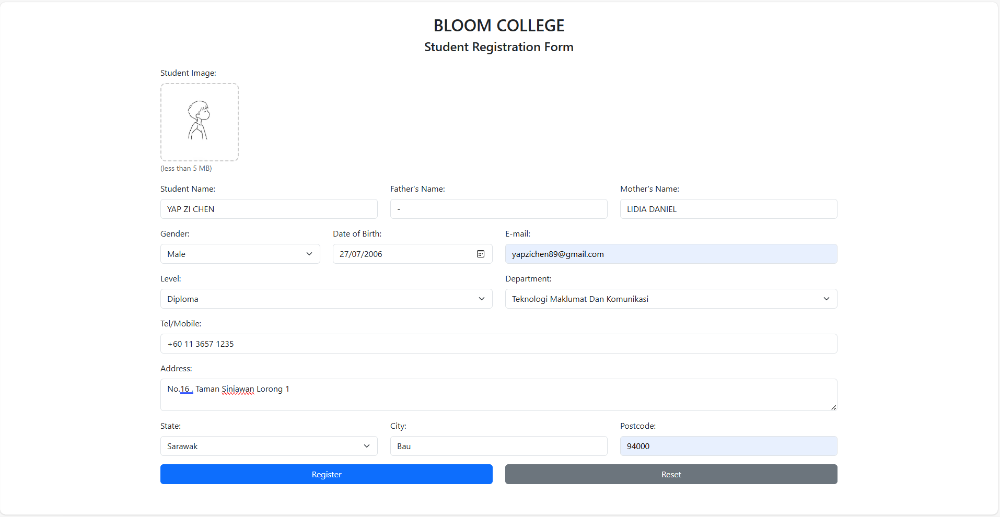

# YAP-ZI-CHEN
its about the Student Registration Form 

## Overview
creating a web site using Visual Code

## Features
is a form for student to make registration

## Technologies Used
- HTML, CSS, JS
- Bootstrap 

## Screenshot

## Installation
1. Clone this repository
2. Open in VS Code
3. Run using Live Server
 
## Contributors
- Name: YAP ZI CHEN
- Course: WEB DISIGN
- Institution: Politeknik Kuching Sarawak
